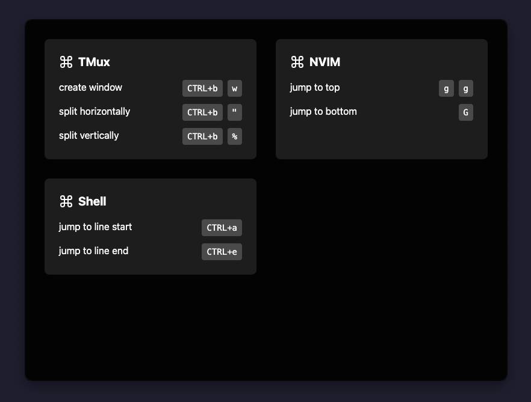

# Cheatsheet

A customizable cheatsheet as an eletron app for MacOS (should work on windows but I don't care much about it currently).

It will appear when you press `COMMAND`+`OPTION`+`z` and disappear again when you press that combination again. You can change that combination in the bottom of the `src/main.ts` file.

What you will see is defined in [this](./cheatsheet.toml) file, it's loaded by a `__dirname` reference, so it would need to stay in this directory if you don't do something about it.

A file like this:

```toml
[tmux]
name = "TMux"
shortcuts = [
  { name = "create window", cmd = [
    "CTRL+b",
    "w"
  ] },
  { name = "split horizontally", cmd = [
    "CTRL+b",
    "\""
  ] },
  { name = "split vertically", cmd = [
    "CTRL+b",
    "%"
  ] },
]

[nvim]
name = "NVIM"
shortcuts = [
  { name = "jump to top", cmd = [
    "g",
    "g"
  ] },
  { name = "jump to bottom", cmd = [ "G" ] }
]

[shell]
name = "Shell"
shortcuts = [
  { name = "jump to line start", cmd = [ "CTRL+a" ] },
  { name = "jump to line end", cmd = [ "CTRL+e" ] }
]
```

Would create a cheatsheet like this:



## Requirements

- Node +20
- Mac
